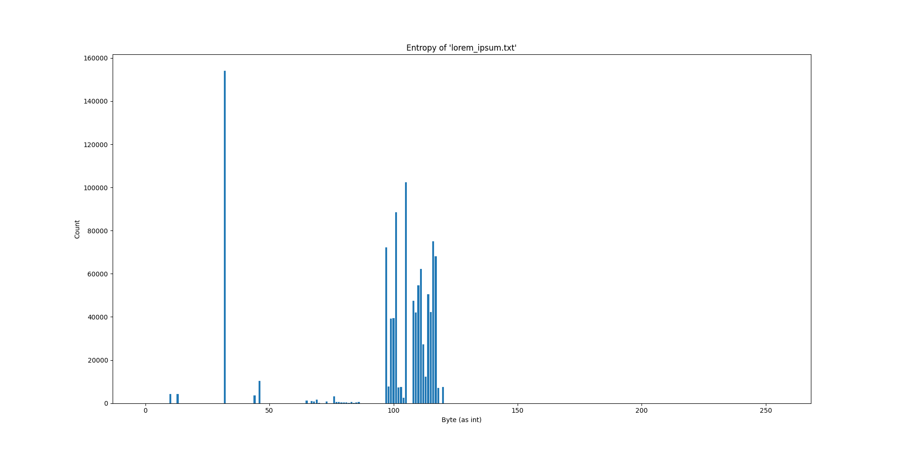
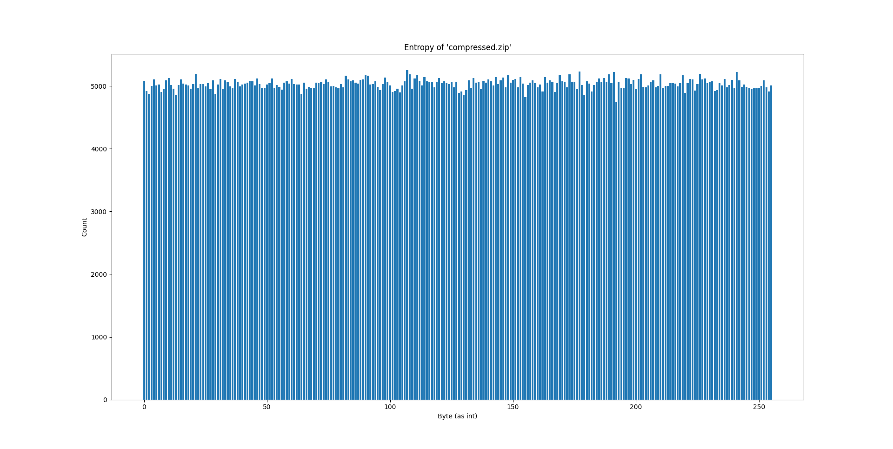
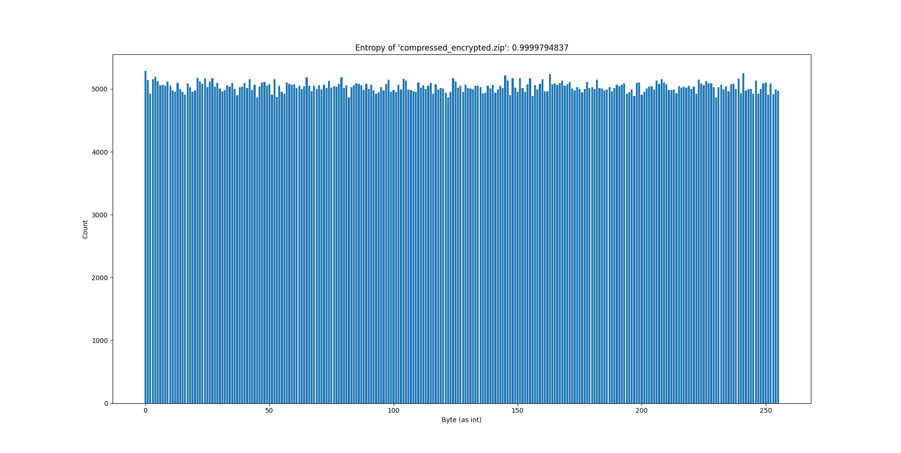

# CFV Demo

Demos zur Studienarbeit mit dem Thema "Vergleich und Analyse von Kompressionsalgorithmen und deren
Verschlüsselungsmethoden im Bezug auf die forensische Untersuchung"

## Demo Daten

### Generierung von zufälligen binären Daten

```shell
head -c 1M /dev/urandom > random.bin
```

#### Entropie


### Generierung von UTF-8-Text (Lorem Ipsum)

Nutzung von [CyberChef](https://gchq.github.io/CyberChef/#recipe=Generate_Lorem_Ipsum(1048576,'Bytes')) (lädt kurz, bis
sich Output befüllt) und Download des Ergebnisses als Datei

#### Entropie



### Komprimierte Dateien

- `compressed.zip`
  - Wörterbuchgröße: 32kB (default)
  - Kein Passwort
- `compressed_encrypted.zip`
  - Wörterbuchgröße: 32kB (default)
  - Passwortgeschützt mit Passwort "password"


#### Entropie komprimiert



#### Entropie komprimiert und verschlüsselt


