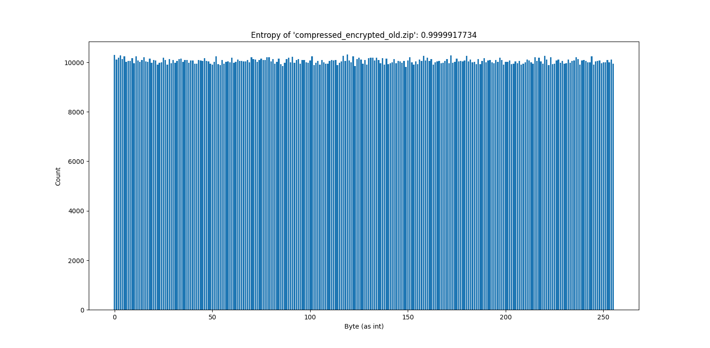

# Entropie Analysen

## Berechnung der Entropie

1) Analyse der Datei (oder von Blöcken dieser) Byte für Byte
2) Zählen der Vorkommnisse aller möglichen Bytes
3) [Berechnung der Entropie](https://welt-der-bwl.de/Entropie) für gesamte Datei oder Bereiche der Datei (Wertebereich
   0-1)

> Ideen
> - Häufigkeitsanalyse von Nibbles oder Byte-Tupeln statt einzelnen Bytes
> - Anpassung der Block-Größe für detaillierte Dateianalysen

## Häufigkeiten der Bytes (gesamte Datei)

### Zufällige Binärdaten

### UTF-8-Text

### Ausführbare Datei

### ZIP

### Verschlüsseltes ZIP

### Verschlüsseltes ZIP (Alt)

## Entropie von Dateibereichen (Blöcke von 4096 Bytes)

> TODO
