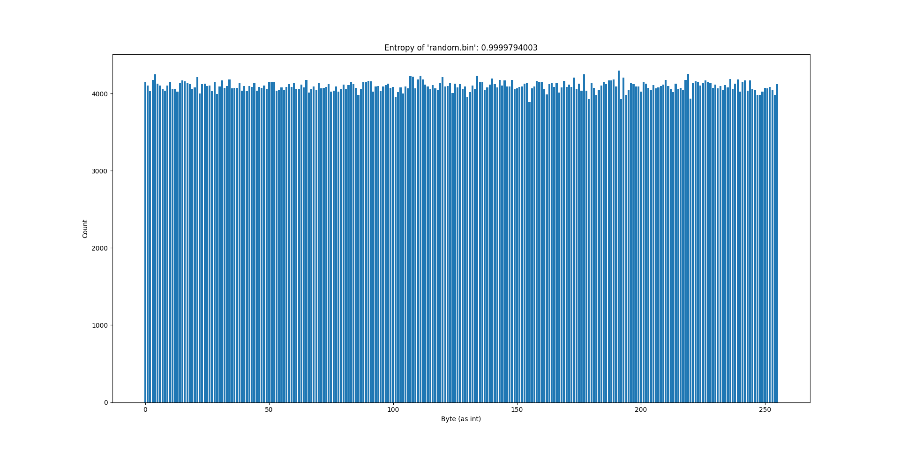
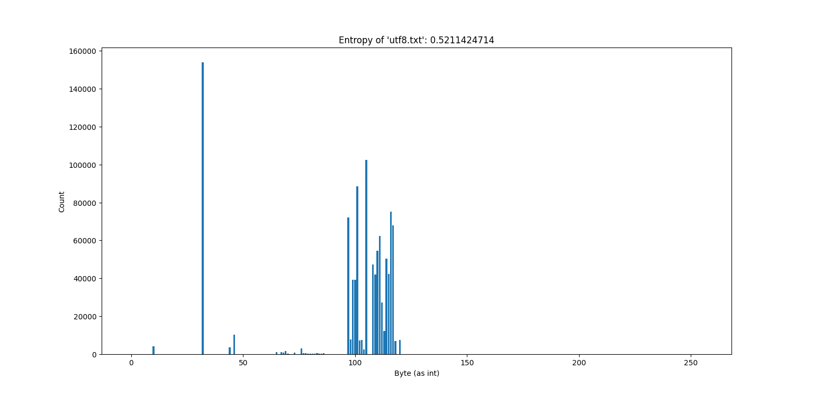
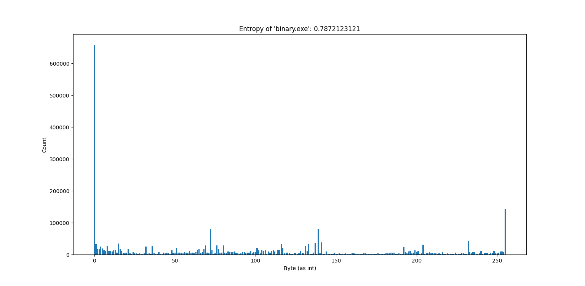
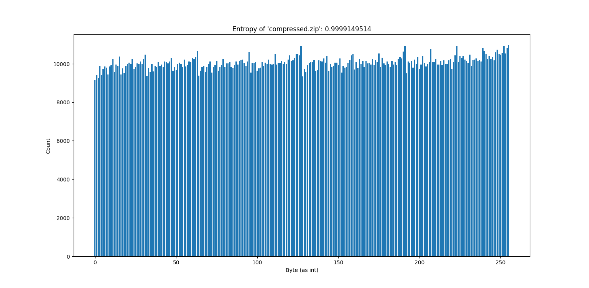
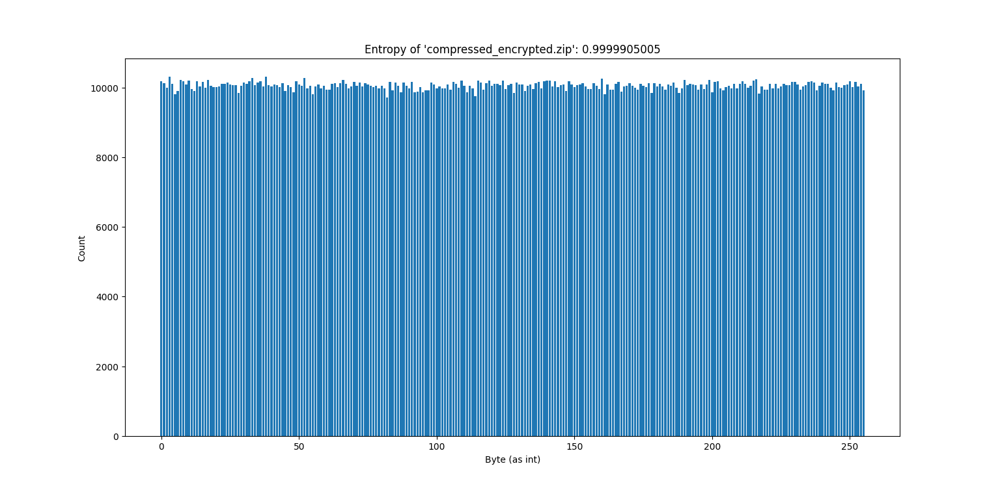
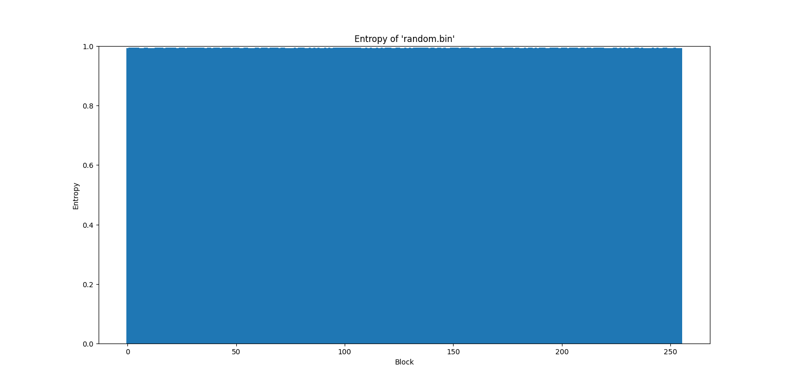
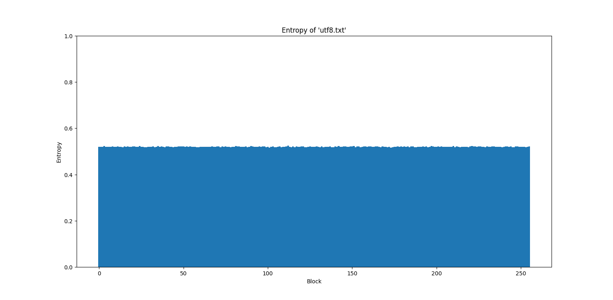
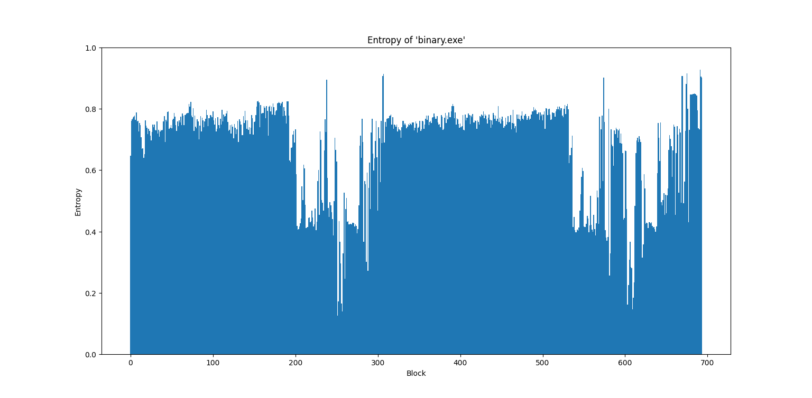
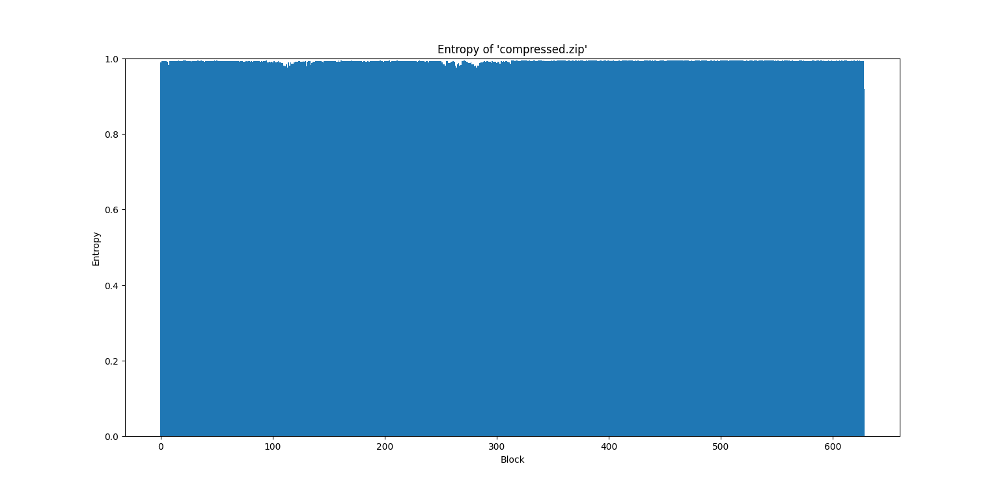
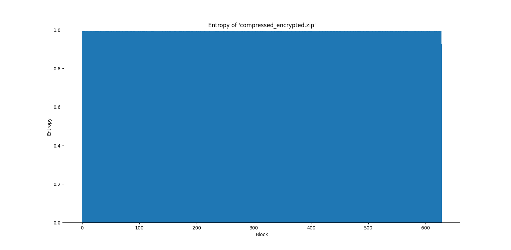

# Entropie Analysen

## Berechnung der Entropie

1) Analyse der Datei (oder von Blöcken dieser) Byte für Byte
2) Zählen der Vorkommnisse aller möglichen Bytes
3) [Berechnung der Entropie](https://welt-der-bwl.de/Entropie) für gesamte Datei oder Bereiche der Datei (Wertebereich
   0-1)
4) Bei Blöcken: Größe von mindestens 4096 Bytes (aussagekräftig)

> Ideen
> - Häufigkeitsanalyse von Nibbles oder Byte-Tupeln statt einzelnen Bytes
> - Anpassung der Block-Größe für detaillierte Dateianalysen

## Häufigkeiten der Bytes (gesamte Datei)

### Zufällige Binärdaten

- Sehr hohe Entropie

### UTF-8-Text

- Viele 0x20 Bytes (Space)
- Viele Buchstaben-Bytes (ASCII)

### Ausführbare Datei

- Viele 0x00 Bytes

### ZIP

- Sehr hohe Entropie

### Verschlüsseltes ZIP

- Sehr hohe Entropie

## Entropie von Dateibereichen (Blöcke von 4096 Bytes)

### Zufällige Binärdaten

- Keine Entropie-Schwankungen
- Durchgehend sehr hohe Entropie

### UTF-8-Text

- Keine Entropie-Schwankungen
- Durchgehend geringe Entropie

### Ausführbare Datei

- Starke Entropie-Schwankungen innerhalb der Datei
- Verschiedene Bereiche einer Executable haben unterschiedliche Entropie

### ZIP

- Kaum Entropies-Schwankungen (woher kommen kleine Schwankungen?)
- Durchgehend sehr hohe Entropie

### Verschlüsseltes ZIP

- Keine Entropies-Schwankungen
- Durchgehend sehr hohe Entropie
