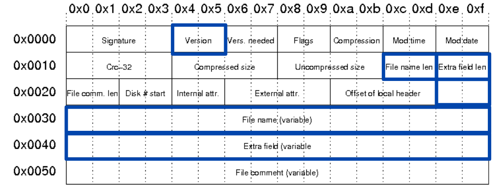

# Demos der Präsentation

## Entropie Analyse Tool

> TODO: Add demo stuff

## Verwendeter Algorithmus und Parameter asu ZIP-Archiv gewinnen

> TODO: Most likely remove

## Analyse eines ZIP-Archivs auf seine Herkunft

Ziel dieser Analyse ist die Nutzung eines Hex-Dumps, um Metadaten eines Datei Headers im Central Directory auf die
Herkunft dieser Datei zu untersuchen. Dabei wird speziell auf die Version (ZIP-Version und OS), den Dateinamen und das
Extra field eingegangen.

Als Demo-Datensatz wird das [dataset_1.zip](../../demo_data/dataset_1.zip) verwendet.

### 1. Hex-Dump des Datei Headers extrahieren

Zunächst werden die letzten 256 Bytes der Datei betrachtet:

```
> tail -c 256 dataset_1.zip | hexdump -C

00000000  14 a4 00 7c 89 ad 00 2c  00 24 00 00 00 00 00 00  |...|...,.$......|
00000010  00 20 80 b4 81 40 00 00  00 68 6f 6d 65 2f 63 61  |. ...@...home/ca|
00000020  73 65 2f 44 6f 63 75 6d  65 6e 74 73 2f 63 66 76  |se/Documents/cfv|
00000030  2f 64 61 74 61 73 65 74  5f 31 2f 67 61 72 64 65  |/dataset_1/garde|
00000040  6e 2e 64 6e 67 0a 00 20  00 00 00 00 00 01 00 18  |n.dng.. ........|
00000050  00 80 55 b9 ef d1 97 d9  01 80 55 b9 ef d1 97 d9  |..U.......U.....|
00000060  01 80 7c 72 19 d2 97 d9  01 50 4b 01 02 3f 03 14  |..|r.....PK..?..|
00000070  03 01 00 08 00 84 7a bf  56 ab bc 06 01 25 e0 01  |......z.V....%..|
00000080  00 6d 25 08 00 2f 00 24  00 00 00 00 00 00 00 20  |.m%../.$....... |
00000090  80 80 81 c2 14 a4 00 68  6f 6d 65 2f 63 61 73 65  |.......home/case|
000000a0  2f 44 6f 63 75 6d 65 6e  74 73 2f 63 66 76 2f 64  |/Documents/cfv/d|
000000b0  61 74 61 73 65 74 5f 31  2f 72 66 63 5f 37 39 33  |ataset_1/rfc_793|
000000c0  5f 34 2e 74 78 74 0a 00  20 00 00 00 00 00 01 00  |_4.txt.. .......|
000000d0  18 00 00 f4 b8 9e c2 93  d9 01 00 85 4d 7a d1 97  |............Mz..|
000000e0  d9 01 00 21 32 21 d2 97  d9 01 50 4b 05 06 00 00  |...!2!....PK....|
000000f0  00 00 03 00 03 00 73 01  00 00 34 f5 a5 00 00 00  |......s...4.....|
```

An der Signatur `0x504b0102` ist der Start des letzten Datei-Headers (die
Datei `home/case/Documents/cfv/dataset_1/rfc_793_4.txt` wird nun weiter betrachtet) erkennbar. Daher kann ein kleinerer
Bereich betrachtet werden:

```
> tail -c 151 dataset_1.zip | hexdump -C

00000000  50 4b 01 02 3f 03 14 03  01 00 08 00 84 7a bf 56  |PK..?........z.V|
00000010  ab bc 06 01 25 e0 01 00  6d 25 08 00 2f 00 24 00  |....%...m%../.$.|
00000020  00 00 00 00 00 00 20 80  80 81 c2 14 a4 00 68 6f  |...... .......ho|
00000030  6d 65 2f 63 61 73 65 2f  44 6f 63 75 6d 65 6e 74  |me/case/Document|
00000040  73 2f 63 66 76 2f 64 61  74 61 73 65 74 5f 31 2f  |s/cfv/dataset_1/|
00000050  72 66 63 5f 37 39 33 5f  34 2e 74 78 74 0a 00 20  |rfc_793_4.txt.. |
00000060  00 00 00 00 00 01 00 18  00 00 f4 b8 9e c2 93 d9  |................|
00000070  01 00 85 4d 7a d1 97 d9  01 00 21 32 21 d2 97 d9  |...Mz.....!2!...|
00000080  01 50 4b 05 06 00 00 00  00 03 00 03 00 73 01 00  |.PK..........s..|
00000090  00 34 f5 a5 00 00 00                              |.4.....|
```

Das End of Central Directory kann ebenfalls ignoriert werden, um nur den Datei-Header zu erhalten:

```
> tail -c 151 dataset_1.zip | head -c 129 | hexdump -C

00000000  50 4b 01 02 3f 03 14 03  01 00 08 00 84 7a bf 56  |PK..?........z.V|
00000010  ab bc 06 01 25 e0 01 00  6d 25 08 00 2f 00 24 00  |....%...m%../.$.|
00000020  00 00 00 00 00 00 20 80  80 81 c2 14 a4 00 68 6f  |...... .......ho|
00000030  6d 65 2f 63 61 73 65 2f  44 6f 63 75 6d 65 6e 74  |me/case/Document|
00000040  73 2f 63 66 76 2f 64 61  74 61 73 65 74 5f 31 2f  |s/cfv/dataset_1/|
00000050  72 66 63 5f 37 39 33 5f  34 2e 74 78 74 0a 00 20  |rfc_793_4.txt.. |
00000060  00 00 00 00 00 01 00 18  00 00 f4 b8 9e c2 93 d9  |................|
00000070  01 00 85 4d 7a d1 97 d9  01 00 21 32 21 d2 97 d9  |...Mz.....!2!...|
00000080  01                                                |.|
```

### 2. Anwendung des Datei Header Formats



Bei der Anwendung des obigen Formats auf den extrahierten Hexdump wird festgestellt, dass die folgenden Werte enthalten
sind:

| Parameter                | Wert                                                        |
|--------------------------|-------------------------------------------------------------|
| Version                  | `0x3f03` (`0x3f` = Quell-ZIP-Version 6.3, `0x03` = Unix OS) |
| File name                | (ASCII) `home/case/Documents/cfv/dataset_1/rfc_793_4.txt`   |
| Extra field (Key `000a`) | (NTFS Timestamps)                                           |

### 3. Auswertung der Ergebnisse

- Die Datei wurde unter Unix mit einem Tool, welches die ZIP-Version 6.3 unterstützt komprimiert
- Aus dem Extra field geht für NTFS geht hervor, dass auf dem Quell-System ein NTFS-Filesystem verwendet wurde
- Aus dem File name geht wegen des Pfades hervor, wo die Datei abgelegt war und dass der Benutzername wohl `case` war

## Angriff auf ein AES verschlüsseltes ZIP-Archiv

Ziel dieses Angriffs ist das Knacken eines ZIP-Passwortes durch Brute-Force Mithilfe von John the Ripper.

Als Test-Datensatz werden die Dateien [random_data.bin](../../demo_data/example_data/random_data.bin)
und [rfc_793_4.txt](../../demo_data/example_data/rfc_793_4.txt) in das Archiv [4_crack_zip.zip](files/4_crack_zip.zip)
mit den Deflate Standard-Parametern verpackt. Dieses wird mit dem Passwort `shakespeare` (kommt recht weit vorne in
rockyou.txt vor) AES-256-verschlüsselt.

### 1. Extraktion der "Hashes"

Da es keine Hashes gibt werden andere entsprechende Informationen mit dem Tool zip2john (Teil
von [John the Ripper](https://github.com/openwall/john)) extrahiert, welche als "Hash" gespeichert werden:

``` shell
zip2john 4_crack_zip.zip > hash.txt
```

Die Datei `hash.txt` enthält nun zwei "Hashes", weil zwei verschlüsselte Dateien im Archiv sind.

### 2. Knacken des Passwortes

Zum Knacken der "Hashes" werden nun John the Ripper und die
Wordlist [rockyou.txt](https://github.com/brannondorsey/naive-hashcat/releases/download/data/rockyou.txt) verwendet. Die
Wordlist könnte hier beliebig erweitert werden (z.B. durch Pre-Processing), um auch weitere Passwörter zu testen.

```
> john --wordlist=rockyou.txt --pot=passwords.txt hash.txt

Using default input encoding: UTF-8
Loaded 2 password hashes with 2 different salts (ZIP, WinZip [PBKDF2-SHA1 256/256 AVX2 8x])
Loaded hashes with cost 1 (HMAC size) varying from 122905 to 10485760
Will run 16 OpenMP threads
Press 'q' or Ctrl-C to abort, almost any other key for status
shakespeare      (4_crack_zip.zip/random_data.bin)
shakespeare      (4_crack_zip.zip/rfc_793.txt)
2g 0:00:00:00 DONE (2023-06-12 20:00) 7.692g/s 126030p/s 252061c/s 252061C/s 123456..dyesebel
Use the "--show" option to display all of the cracked passwords reliably
Session completed.
```

Zu erkennen ist, dass beide (identischen) Passwörter geknackt wurden.

## BONUS: Angriff auf unkomprimiertes ZipCrypto-Archiv

Ziel dieses Angriffs ist das entschlüsseln eines ZIP Archivs ohne Kompression mittels eines Plaintext Angriffs auf ZipCrpto. 

Als Demo-Datensatz wird das [dataset_4.zip](../../demo_data/dataset_4.zip) verwendet.

Für den Angriff werden mind. 12, davon 8 zusammenhänend, Bytes bekannter Klartext inklusive Position benötigt. Für den Demo Datensatz wird 
der Text "TRANSMISSION CONTROL PROTOCOL" mit dem Offset 301Bytes verwendet.
Des Weiteren wird das Tool [bkcrack](https://github.com/kimci86/bkcrack) benötigt, dessen Executable für den weiteren Ablauf des Beispiels im selben 
Verzeichnis wie der Demo-Datensatz liegen sollte.

1. Schritt: schreiben des bekannten Textes in eine File im selben Verzeichnis wie bkcrack executable und der Demo-Datensatz
``` shell
echo -n ’TRANSMISSION CONTROL PROTOCOL’ > plain.txt
```
2. Schritt: ausführen des bkcrack befehls
'-C' -> das Zielarchiv welches geknackt werden soll
'-c' -> die File im Zielarchiv welche den Bekannten Text enthält
'-p' -> die Datei mit dem bekannten Klartext
'-o' -> der Offset des bekannten Klartext (optional, nicht benötigt, wenn klartext zu Filebeginn)
``` shell
./bkcrack -C dataset_4.zip -c rfc_793_4.txt -p plain.txt -o 301
```
Das Tool gibt im Erfolgsfall 3 interne Keys zurück.
3. Schritt: 3 Möglichkeiten um fortzufahren
3.1  Datei entschlüsseln und Inhalt in einer neuen Datei ablegen
'-k' -> die gefundenen Keys aus dem vorherigen Schritt
'-d' -> der Name für die Datei in welche der entschlüsselte Inhalt geschrieben werden soll
``` shell
./bkcrack -C dataset_4.zip -c rfc_793_4.txt -k Key1 Key2 Key3 -d entschluesselte_daten
```
3.2 Inhalte des Zielarchivs in ein neues Archiv mit neuen Passwort kopieren
'-k' -> die Keys aus Schritt 2
'-U' -> der Name des neuen Archivs mit neuem Passwort
``` shell
./bkcrack -C dataset_4.zip -k Key1 Key2 Key2 -U neues_archiv.zip neues_pw
```
3.3 Passwort des Zielarchivs mit Brute Force herausfinden
Hier kann man sich über Kombinationen von Obergrenze sowie den Optionen für die Zeichen an das PAsswort annähern.
'-r' -> Teil 1: Obergrenze des Zeichen im Passwort
        Teil 2: Optionen für die Zeichen des Passworts 
                ?b = alle Bytes 0-255
                ?p = alle druckbaren Bytes
                ?a = alle alphanumerischen Bytes
``` shell
./bkcrack -C dataset_4.zip -k Key1 Key2 Key3 -r 9 ?p
```
